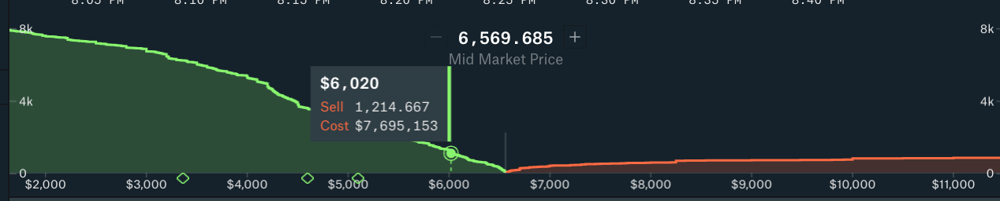
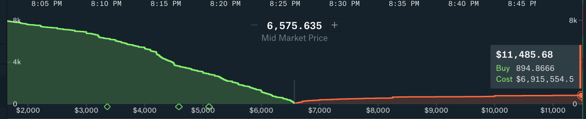
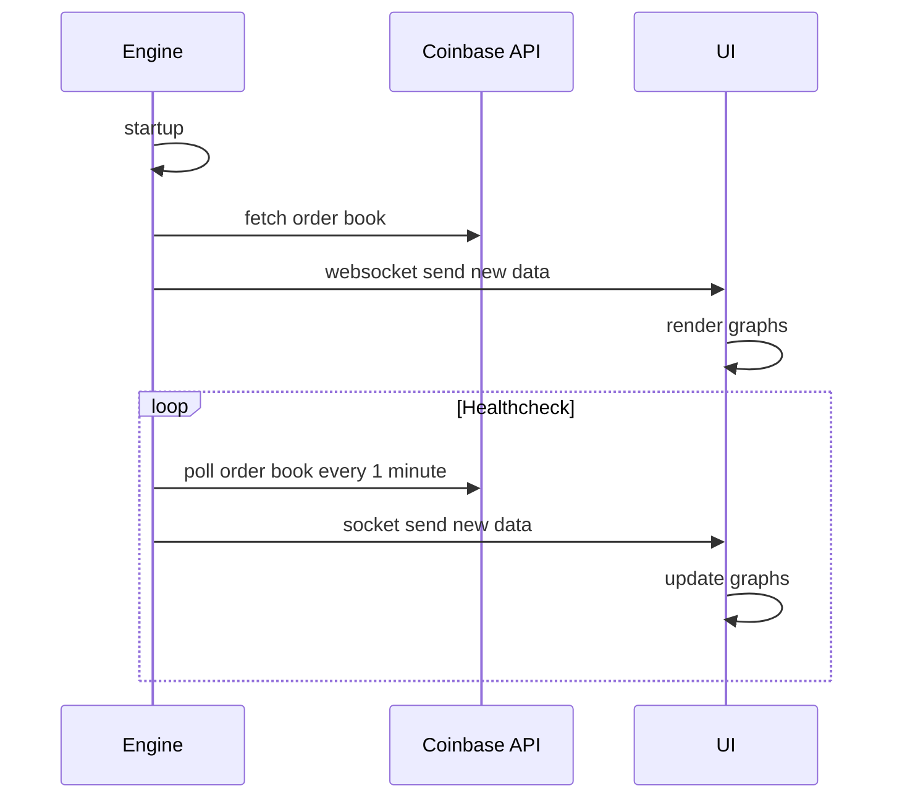
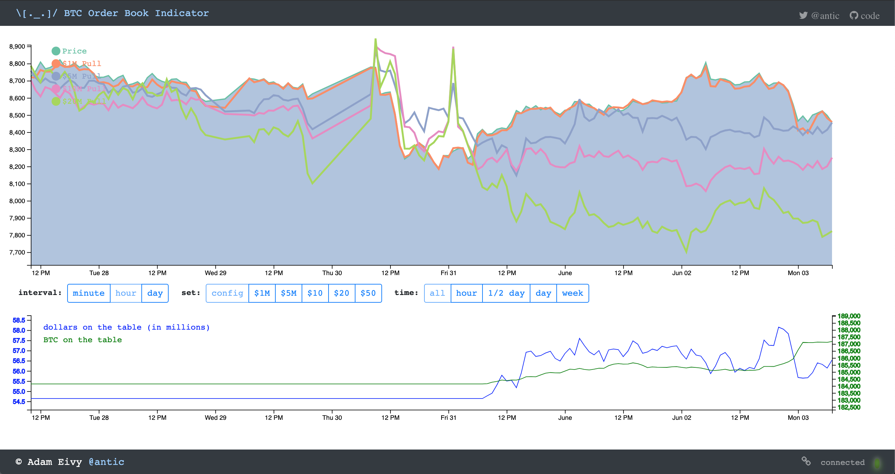
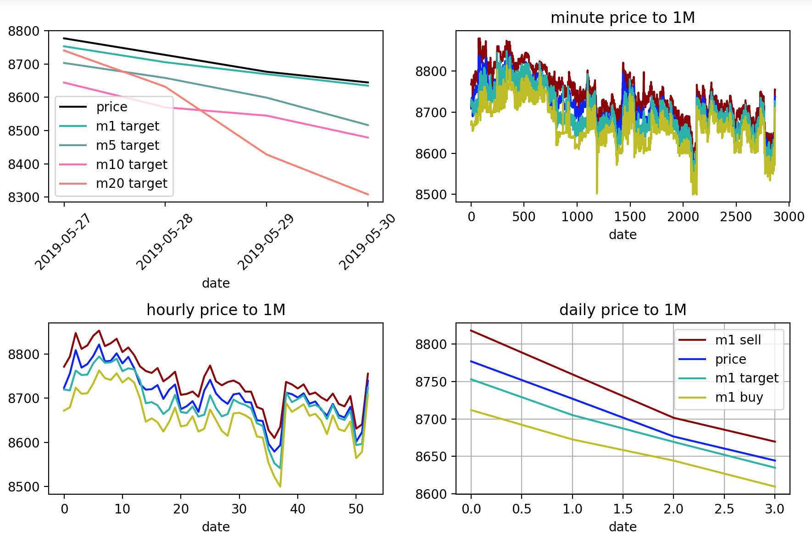

# BTC Order Book Indicator

> DISCLAIMER: nothing in this project is financial advice. Any ideas of trading, investment, or other tomfoolery is at your own risk, discretion, and responsibility. The creator of this project has no position in Bitcoin. This is just for scientific interest.

Polls the Coinbase Pro order book for BTCUSD and logs the following:
- `datetime`
- the current `price`
- `m1_buy`: the price at which the order book would slip downward if someone (or many people) market sold down $1M worth
- `m1_sell`: the price at which the order book would slip upward if someone market purchased $1M worth
- same for $5M (`m5_buy`, `m5_sell`), $10M, $20M, $30M, $40M, $50M

This data set can then be used to construct a trading indicator, showing how the order book price volumes relate to the changing prices.

## The Indicator
The primary theoretical indicator is called "pull" and shows the weight that the orderbook plays on pulling the price into a new direction. The pull is calculated for each threshold ($1M, $5M, $10M, $20M, $50M) using this formula: 
`sell_limit_price - market_price + buy_limit_price`

To make more sense of this, you can think of it as taking the dollar difference between the actual `price` and the slippage up (`sell_diff`), and taking the dollar slippage between the actual `price` and the slippage down (`buy_diff`), then measuring the pull as `price + sell_diff - buy_diff`.

### Example
In the case of the `$1,000,000` price threshold: 
- let's say the `price` is `$8000`
-`$1M` in buying would slip upward to `$8250` - diff is `$250`
-`$1M` in selling would slip downward to `$7500` - diff is `$500`

There is more ceiling pressure than floor support (twice as much), so the `pull` is:
```
8250 - 8000 + 7500 = 7750
```

This indicates that downward movement has less resistence than upward movement.

## What?
Here you can see when Bitcoin was in the `$6500` zone on May 10th, 2019 that the order books were thin on the sell side compared to the buy side. $7.5M in market selling action would reduce the price to `~$6020`, but $7M in market purchases would raise the price to `~$11,500`:


Over the next week, Bitcoin shot up to nearly `$9K`.

## How?



The logger runs every 1 minute and logs to a rolling log file in the `data` directory.
The payload for the BTCUSD orderbook is `2.8MB`, so we have to limit the data collection every minute :)
We log the following columns, tab delimited
```
datetime price size bid ask volume total_buy total_sell_volume max_up_slippage max_down_slippage m1_buy m5_buy m10_buy m20_buy m30_buy m40_buy m50_buy m1_sell m5_sell m10_sell m20_sell m30_sell m40_sell m50_sell
```
We can then take this data in python (there's a Jupyter Notebook in the `notebooks` directory), process the data, and visualize it (just for experimentation).

Additionally, the app runs a UI service that streams the data via websockets to a D3 graph



## Notes on Project Data

This is very experimental. As such, I realized some data I wanted to collect after the engine was running for a few days. Rather than deleting the old data, I backfilled generic approximations for the new data fields:

Data Collection Update #1 (`2019-05-31-081655`):
```
replacing: ([^Z]+Z(\s[\d.]+){5})
with: $1	54635567	184140	250000	0.01
```
These fields are:
`total_buy` `total_sell_volume` `max_up_slippage` `max_down_slippage`

Data Collection Update #2 (2019-06-15):
```
replacing: ([^Z]+Z(\s[\d.]+){13})
with: $1	6612	5850
```
These fields are:
`m30_buy` `m40_buy`
& 
```
replacing: ([^Z]+Z(\s[\d.]+){20})
with: $1	10000   11494
```
These fields are:
`m30_sell` `m40_sell`

## Getting Started

Development mode
* starts up the runner to collect data every minute
* starts the UI
* watches client code for changes
```
npm run setup
npm run dev
```

Production mode
using PM2 to keep the service alive:
```
npm i -g pm2
pm2 start npm --name "btc_orders" -- start; pm2 logs
```

## Visualizing Data

What good is an indicator without some data visualization?

For now, I'm playing with the data in Python because that's where I have all my machine learning tooling.
Launch Jupyter Notebooks to ingest the data in python:

locally:
```
docker run -it -v $(pwd):/home/jovyan --rm -p 8888:8888 jupyter/scipy-notebook
```
or [launch on the web using MyBinder](https://mybinder.org/v2/gh/atomantic/bitcoin_orderbook_indicator/master)


*here we see running the engine for a few days during a price pump*

Additionally, the app now launches a UI service that charts the data using D3, and live updates as the runner collects more data.


## What Else?

You might be interested in some of my Pine Script indicators: https://github.com/atomantic/pine_scripts
