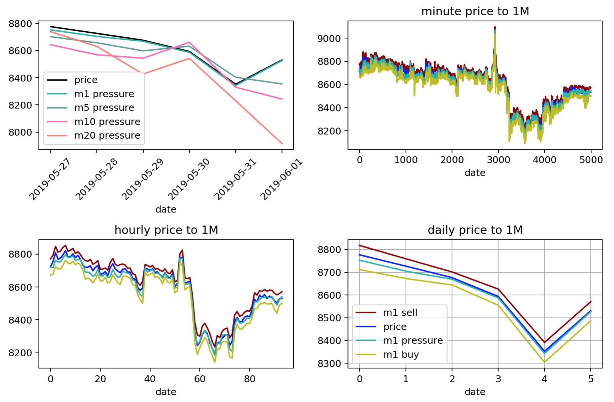

# BTC Order Book Indicator

Watches the Coinbase Pro order book for BTC and logs
- the current price
- the price point at which the order book could fall by $1M
- the price point at which the order book could rise by $1M
- same for $5M, $10M, $10M, $50M

This data set can then be used to construct a trading indicator, showing how the order book price volumes relate to the changing prices.

## What?
Here you can see when Bitcoin was in the `$6500` zone that the order books were thin on the sell side. $7M in market selling action would reduce the price to `~$6020`, but $7M in market purchases would raise the price to `~$11,500`:


Over the next week, Bitcoin shot up to nearly `$9K`.

## How?
The logger runs every 1 minute and logs to a rolling log file in the `data` directory.
It logs the following columns, tab delimited
```
datetime price size bid ask volume m1_buy m5_buy m10_buy m20_buy m50_buy m1_sell m5_sell m10_sell m20_sell m50_sell
```

## Getting Started

```
npm i
npm start
```

or run as a never stopping service with PM2
```
npm i -g pm2
pm2 start npm --name "btc_orders" -- start; pm2 logs
```

## Visualizing Data

What good is an indicator without some data visualization?

For now, I'm playing with the data in Python because that's where I have all my machine learning tooling.
Launch Jupyter Notebooks to ingest the data in python:

locally:
```
docker run -it -v $(pwd):/home/jovyan --rm -p 8888:8888 jupyter/scipy-notebook
```
or [launch on the web using MyBinder](https://mybinder.org/v2/gh/atomantic/bitcoin_orderbook_indicator/master)

`TODO`: would be cool to also load this up using [D3](https://d3js.org/) in JavaScript to make a website for it.


*here we see running the engine for about 2 days during a price pump*